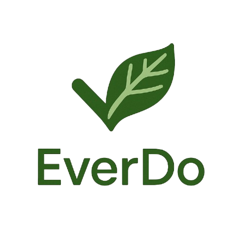

# ✨ EverDo - Smart Daily Task Manager

EverDo is a sleek, responsive, and interactive daily task manager built using HTML, CSS, and vanilla JavaScript. It helps users organize their daily tasks with ease, track their productivity, and plan ahead — all in a beautifully designed interface.

<div align="center">
  
</div>

## 📈 Features

### ✅ Core Functionality

- ➕ **Add Tasks**: Quickly add new tasks for today or any other day.
- ✔️ **Complete/Uncomplete**: Toggle tasks with one click.
- ❌ **Delete**: Remove tasks instantly.

### 🗓️ Daily Task Management

- ⏹ **Date Navigation**: Scroll through dates to view/edit tasks.
- 📅 **Date-Specific Storage**: Tasks are tied to specific days via `localStorage`.

### ⭐ Productivity Tools

- 🌿 **Progress Bar**: Track your daily task completion visually.
- 🔢 **Stats**: Get real-time progress (e.g., 3/5 tasks completed).

### ⌛ Quick Actions

- → **Move to Today**: Migrate unfinished tasks to today.
- ✔️ **Complete All**: Finish all tasks of a selected day.

### 🛠️ Bonus Features

- 👀 **Drag-and-Drop**: Reorder tasks with ease.
- 🌐 **Responsive Design**: Works great on phones, tablets, and desktops.
- 🌚 **Dark Mode**: Adapts to your system’s color scheme.
- 📃 **Favicon**: Includes a branded favicon (`favicon.ico`).

## 📊 Tech Stack

<div align="center">
  
  
  
  
</div>

## 📂 Folder Structure

```bash
EverDo/
├── index.html
├── styles.css
├── script.js
└── images/
    ├── everdo-logo.svg
    └── favicon.ico
```

## 🔧 Installation

No setup required. Just open the HTML file in any browser:

```bash
git clone https://github.com/your-username/everdo.git
cd everdo
open index.html
```

## 🔄 Future Improvements

- ⬆️ **Task Priorities & Labels**: Color-coding, filters, priority indicators
- 📓 **Task Notes & Subtasks**: Expandable notes, checklists
- ↺ **Undo/Redo Actions**: Ctrl+Z support, toast notifications
- ⌨️ **Keyboard Shortcuts**: Quick-add, bulk actions, navigation
- 🔍 **Task Search & Archive**: Global search, archive old/completed tasks
- ⏲️ **Pomodoro/Timer Integration**: Focus mode, productivity stats
- 🌟 **Habit Tracking**: Streaks, badges, daily consistency
- 🌌 **Focus Mode**: Minimalist UI, fullscreen task viewer
- 🚫 **Offline Enhancements**: Offline-first design, sync indicators

## 💌 License

This project is open-source and free to use.

---

Designed with ❤️ for productivity!
